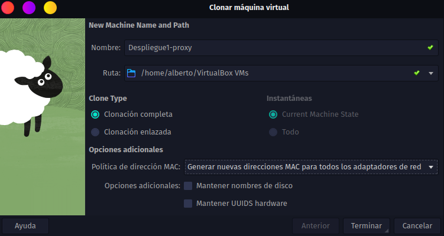
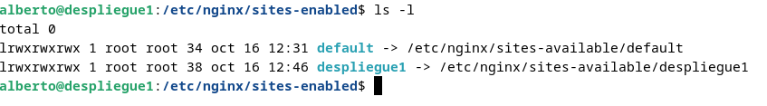
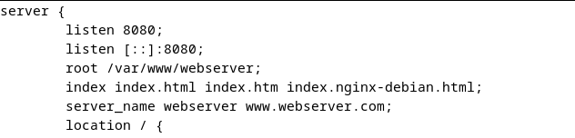
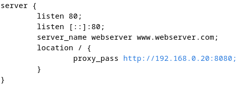
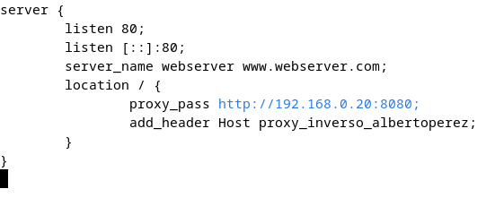
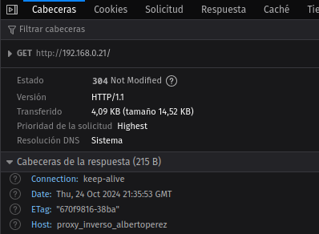

# Práctica 2.3 - Proxy inverso con Nginx

## Clonación de MV

Para crear un servir de proxy inverso, en primer lugar necesitaremos una nueva MV que 
cumpla con este rol. Para ello, clonamos la máquina virtual en la que ya teníamos 
configurado Nginx, de manera que tendremos dos máquinas virtuales idénticas:



## Cambios en la MV con rol de Server Web

Los cambios de este apartado se realizan sobre la MV que vaya a funcionar como servidor web, 
es decir, la que se enfoca a alojar los datos de nuestra página.

Para ello cambiaremos el nombre de nuestra página a 'webserver', tanto del directorio 
en /var/www que contiene los archivos de la página como en el archivo de configuración en 
/etc/nginx/sites-available y el enlace simbólico a /etc/nginx/sites-enabled.

En primer lugar, ejecutamos:
```console
cd /var/www
sudo mv despliegue1/ webserver/
```

A continuación, para listar los enlaces simbólicos y comprobar sus nombres podemos ejecutar:
```console
cd /etc/nginx/sites-enabled
ls -l
```



A continuación eliminamos el symlink (en mi caso se llama despliegue1 porque es el nombre 
que le di a mi página) con el comando:
```console
sudo unlink despliegue1
```

Ahora cambiamos el nombre del sitio a 'webserver' en el archivo de configuración de 
la página. Con: 
```console
cd /etc/nginx/sites-available
mv despliegue1 webserver
```
cambiamos el nombre del archivo en sí. Realizamos el mismo cambio dentro del archivo de la siguiente manera:



> [!NOTE]
> También se podría realizar un cambio similar en /etc/hosts pero no es 
> estrictamente necesario para el funcionamiento del servidor.

Realizados los cambios sobre el archivo de configuración, creamos un nuevo enlace simbólico ejecutando:
```console
sudo ln -s /etc/nginx/sites-available/webserver /etc/nginx/sites-enabled
```

Reiniciamos Nginx y comprobamos que funciona sin errores con:
```console
sudo systemctl restart nginx
sudo nginx -t
```

## Cambios en la MV con rol de Servidor de Proxy Inverso

Los cambios de este apartado se realizan sobre la MV que vaya a funcionar como servidor proxy, 
es decir, la que se encuentra entre servidor y cliente y redirige las peticiones.

Cambiaremos el contenido del archivo de configuración /etc/nginx/sites-available para que redirija 
las peticiones que reciba al Servidor Web.



> [!IMPORTANT]
> Hay que tener especial cuidado con las IPs que estamos utilizando ya que trabajamos con tres 
> máquinas distintas. En mi caso son 192.168.0.20 (Webserver), 192.168.0.21 (Proxy) y 
> 192.168.0.13 (Máquina anfitriona).

Ahora, si buscamos en el navegador de nuestra máquina anfitriona "192.168.0.21:80", se enviará 
una petición al proxy y será redirigida al servidor web. Podemos comprobar que la petición haya pasado 
por ambos servidores leyendo el archivo /var/log/nginx/access.log en ambas máquinas.

También podemos comprobarlo añadiendo una cabecera a la petición desde el servidor proxy, añadiendo 
una línea más al archivo de configuración:



Ahora, si inspeccionamos la página al entrar desde la máquina anfitriona:



Por lo que queda comprobado que el servidor proxy está funcionando sin problemas.